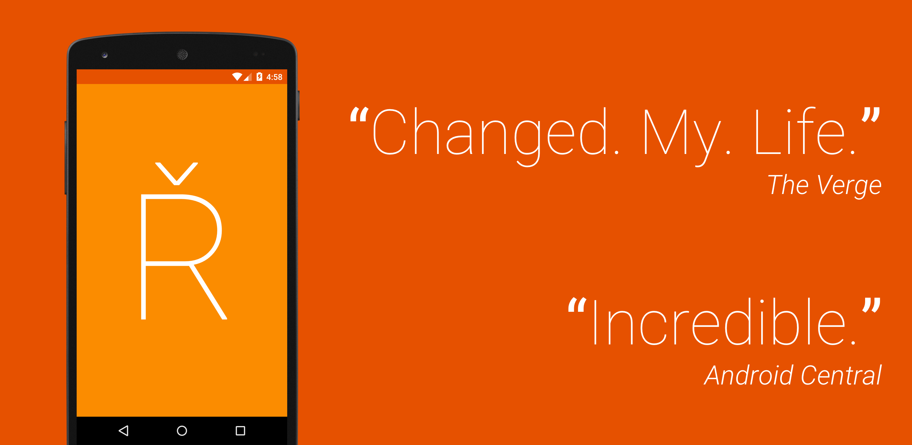
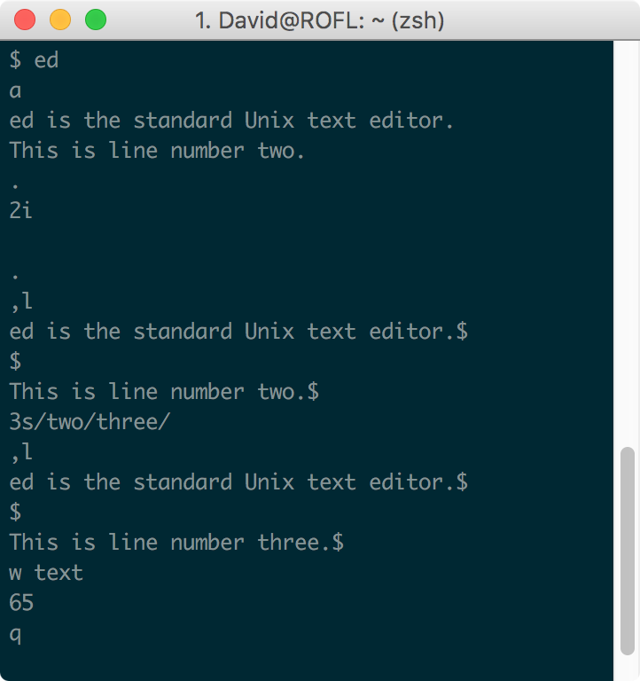
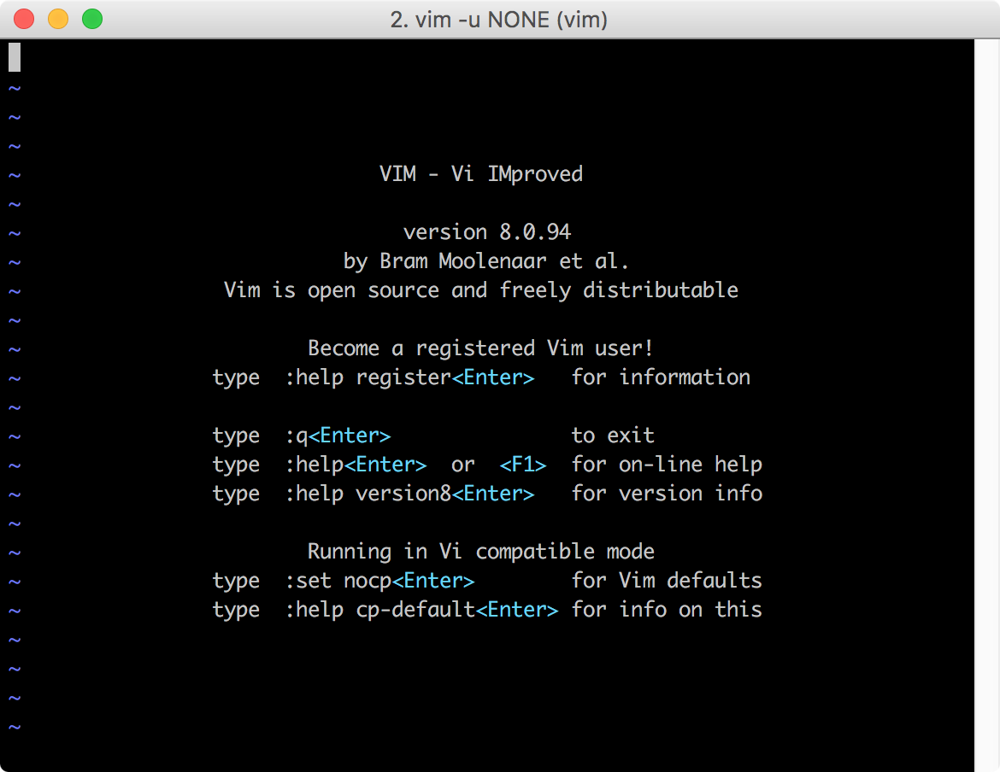
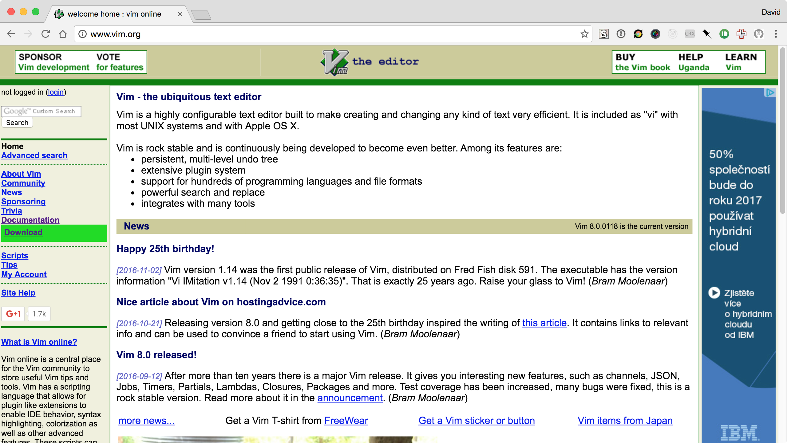
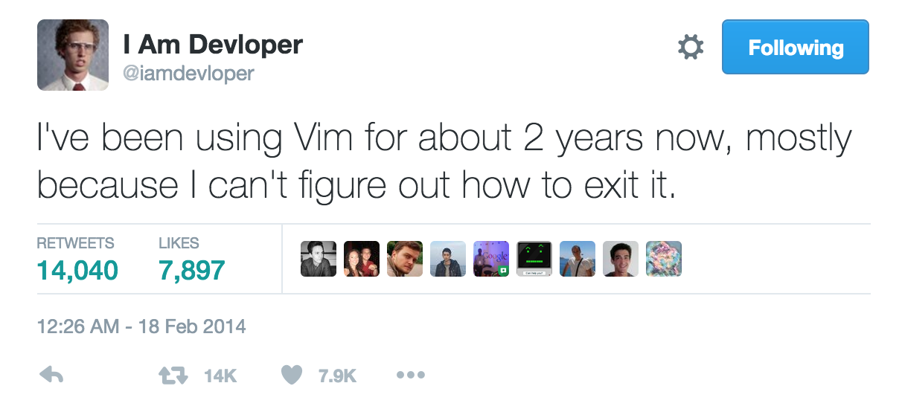
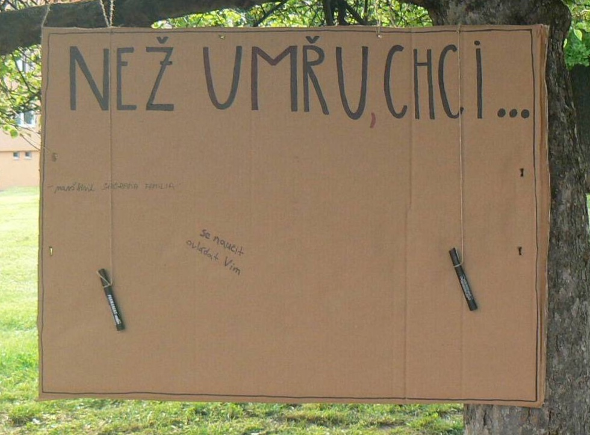
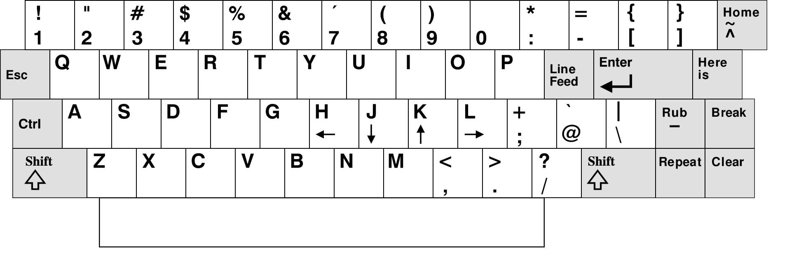
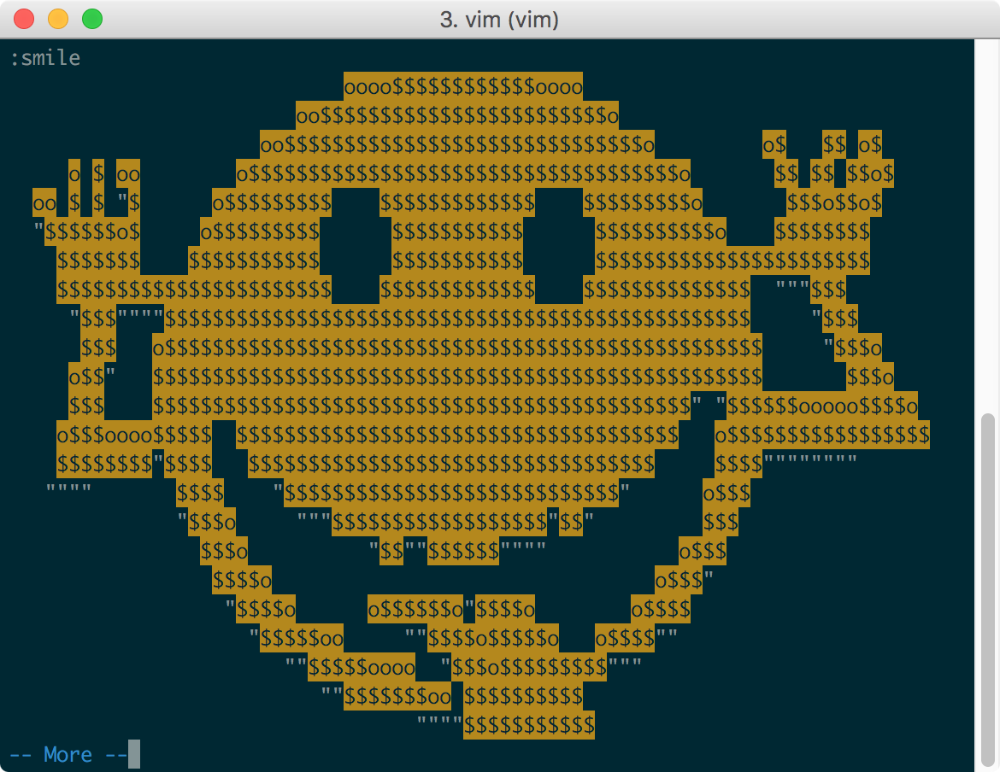

# Vim: textový editor pro hipstery?
David Pavlík, BrNOC 2016

|||

## Kdo jsem?
- chodím do čtvrťáku na Jarošku
- píšu [zápisky](http://zapisky.dpavlik.cz)
- dělám Androidí a webové aplikace
- používám Vim

---
<!-- .slide: data-background="#E65100" -->
<!-- img: border="0" -->

## Ř: Experience “Ř” like never before
 <!-- .element: class="borderless" -->
[dpavlik.cz/ř](http://dpavlik.cz/ř) <!-- .element: class="green" -->

|||

## Průzkum publika

---

### *Kdo z vás se považuje za hipstera?*

---

### *Kdo z vás se považuje za technicky zdatného?*

---

### *Kdo z vás se považuje za geeka?*

---

### *Kdo z vás se považuje za programátora?*

---

### *Kdo z vás se považuje za vývojáře?*

---

### *Kdo z vás používá Windowsy?*

---

### *Kdo z vás používá jakoukoli distribuci Linuxu?*

---

### *KDO Z VÁS POUŽÍVÁ macOS?* <!-- .element: class="normal" -->

---

### *Kdo z vás používá terminál?*

---

### *Kdo z vás má terminál rád?*

---

### *KDO Z VÁS Vim ZNÁ?* <!-- .element: class="normal" -->


---

### *KDO Z VÁS Vim POUŽÍVÁ?* <!-- .element: class="normal" -->

|||

## A teď už k přednášce
Než si ale povíme něco o Vimu, musíme si něco málo říct o historii textových editorů.

|||

## Zběžná historie textových editorů

---

## ed <!-- .element: class="lowercase" -->
- 1971
- *the standard Unix text editor*
- ovládán příkazy

 <!-- .element: class="screenshot-small" -->

---

## em <!-- .element: class="lowercase" -->
- 1976
- *editor for mortals*
- dokázal interaktivně editovat jeden řádek

---

## Emacs <!-- .element: class="normal" -->
- 1976
- neznám, nevim, nepoužívám
- editor flame wars: emacs vs. vi/Vim
- používá Ivana (říkal Štěpán Balážik)
- je tam Tetris a psychoterapeut

---

## en <!-- .element: class="lowercase" -->
- 1976
- kombinoval ed a em
- Bill Joy a Chuck Haley

---

## ex <!-- .element: class="lowercase" -->
- 1976 nebo tak nějak
- *extended en*
- Bill Joy
- původně se ovládal pouze příkazy
- 1977 přidán vizuální mód: *vi*
- inspirováno ed a Xerovým editorem Bravo

---

## Vim <!-- .element: class="normal" -->
- 1991
- *Vi IMproved* (původně *Vi IMitation*)
- Bram Moolenaar
- je postaven na editoru *Stevie* (klon vi)
- open source, charityware

|||

## Jak to vypadá

 <!-- .element: class="screenshot" -->

---

## vim.org



|||

## Jak se to ovládá

---



Note: Tohle není úplně spravedlivé, protože Emacs se ukončuje <C-x> <C-C> a nic to při <C-c> nenapíše, na rozdíl od Vimu.

---

Než umřu, chci se naučit ovládat Vim *(Brno čte Bibli)*


---

### Není to tak složité
Je to jen jiné.

---

### Základem je, že Vim je *modální* editor
To znamená, že se dá používat v různých módech.

---

### Insert mode
V tomto módu můžete normálně psát. Není na něm nic moc zajímavého.

Note: S tímto módem si můžete vystačit a používat Vim pouze jako Notepad. Ale Vim je mnohem víc!

---

### Normal mode
V tomto módu se ocitnete po spuštění a právě tento mód je ze všech nejzajímavější.

Stisknutím tlačítek klávesnice totiž nepíšete, ale nějak upravujete text, pohybujete se v něm atp.

---

### Základní pohyb
- h ←
- j ↓
- k ↓
- l →

Note: Šipky fungují taky.

---

### ADM-3A


---

### Klávesnice ADM-3A



---

### Další pohyb
- `w` – začátek dalšího slova
- `e` – konec dalšího slova
- `b` – začátek předchozího slova
- `0` – začátek řádku
- `$` – konec řádku
- `gg` – začátek dokumentu
- `G` – konec dokumentu

---

### Přepnutí do Insert modu
- `i` (insert) začne psát na aktuální pozici kurzoru
- `a` (append) začne psát za pozicí kurzoru
- `I` začne psát na začátku řádku
- `A` začne psát na konci řádku
- `s` smaže znak pod kurzorem a začne psát
- `o` vloží další pod kurzor a začne psát do něj
- `O` vloží další před kurzor a začne psát do něj

---

### Kombinace!
- `dd` smaže celý řádek
- `d$` smaže řádek od kurzoru
- `dw` smaže slovo od pozice kurzoru
- `diw` smaže celé slovo pod kurzorem
- `ciw` smaže celé slovo pod kurzorem a začne psát
- `3diw` smaže tři slova

---

### Undo a redo
- `u` – zpět
- `U` – vrátit všechny změny na řádku
- `Ctrl+r` – vrátit zpět

---

### Operace se znakem
- `r` nahradí znak pod kurzorem
- `x` smaže znak pod kurzorem

Note: Dvakrát stejná klávesa většinou ovlivňuje celý řádek.

---

### Příkazy
- začínají dvojtečkou, potvrzují se enterem
- `:w` – uložit soubor
- `:w foobar.txt` – uložit soubor jako
- `:q` – ukončit Vim (zavřít panel)
- `:q!` – ukončit Vim bez ukládání
- `:qa` – zavřít všechny panely
- `:qa!` – zavřít všechny panely bez ukládání

---

### Vyhledávání
- `/lol` – vyhledá lol
- `:%s/foo/bar/g` – nahradí všechny foo za bar
- můžete používat regulární výrazy

|||

## Jak může tohle někdo používat?

Note: Dlouhou dobu jsem si to říkal také. Pak jsem narazil na diskuzi na Devel.cz, kde jsem psali o tom, jak je Vim super. Tak jsem si řekl, že to taky zkusím. Zprvu se mi to zdálo divné, ale pak jsem do toho pronikl a dnes nemůžu bez Vimu psát.

|||

## Customizace
Pomocí souboru `~/.vimrc` a pluginů.

---

```vim
" Turbo navigation
noremap H 5h
noremap J 5gj
noremap K 5gk
noremap L 5l
```

---

```vim
" Escape with jj in insert mode
inoremap jj <ESC>
" Save with kk in insert mode
inoremap kk <C-C>:w<CR>
```

---

```vim
" Smartcase in searching
set ignorecase
set smartcase
```

---

```vim
" Compile and run file with F4
autocmd filetype javascript nnoremap <F4> :w
    <bar> exec '!node '.shellescape('%')<CR>
```


---

```vim
" Spell check
autocmd FileType markdown setlocal spell spelllang=cs
autocmd FileType texy setlocal spell spelllang=cs
autocmd FileType gitcommit setlocal spell
```
---

```vim
" Use the first spell check variant
noremap t z=1<Enter><Enter>
```

---

```vim
" Insert a new list item with ;
noremap ; o-<Space>
```

|||

## Vim s grafickým rozhraním
- gVim pro Linux, Windows
- macVim a VimR pro macOS

|||

## Vim se pořád vyvíjí

---

### Vim 8.0
- vyšel v září
- Asynchronous I/O support, Lambda and Closure
- nový příkaz `:smile` – make the user happy

  <!-- .element: class="screenshot-medium" -->

Note: Vim 7.0 je z roku 2006.

---

## Neovim
- fork Vimu, který se snaží o
    - přehlednější kód
    - snazší udržitelnost
    - snazší použití v GUI
    - lepší rozšiřitelnost
- 20 tisíc hvězdiček na GitHubu

|||

## Vim jako IDE
Jsou blázni, co Vim jako IDE používají. Já mezi ně nepatřím.

---

### IDE s *Vim módem*
- dobrou podporu emulace Vimu mají
    - IDE od JetBrains (IDEA, WebStorm, PyCharm aj.)
    - Xcode
    - Visual Studio
    - VS Code
- špatnou podporu (bez mapování) mají
    - Sublime Text
    - Atom

|||

## Tak to je asi konec

---

## Děkuji za pozornost

---

## Prý mám poděkovat své dívce za podporu

---

## A kdyby vás to víc zajímalo...
- moje prezentace: [github.com/xxdavid/vim-brnoc](http://github.com/xxdavid/vim-brnoc)
- můj `.vimrc`: [github.com/xxdavid/dotfiles](http://github.com/xxdavid/dotfiles)
- [vim.wikia.com](http://vim.wikia.com)
- program `vimtutor`
